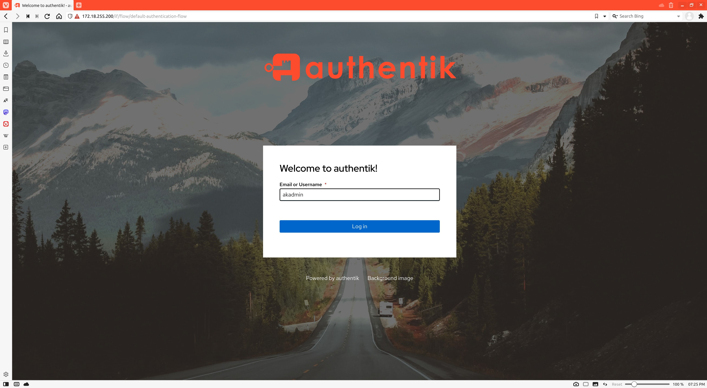
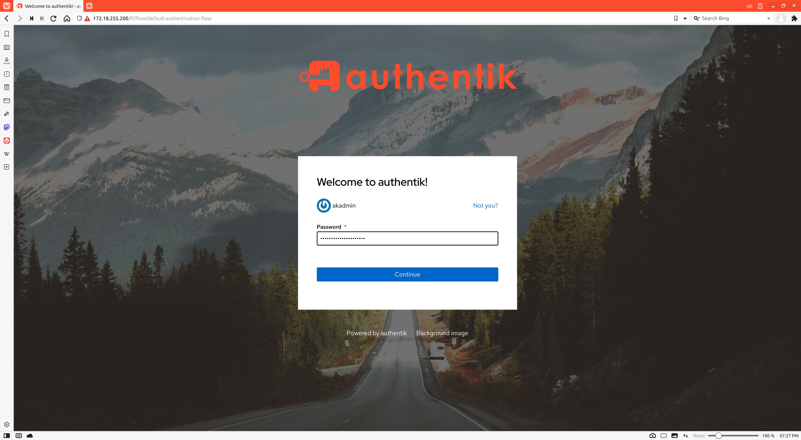
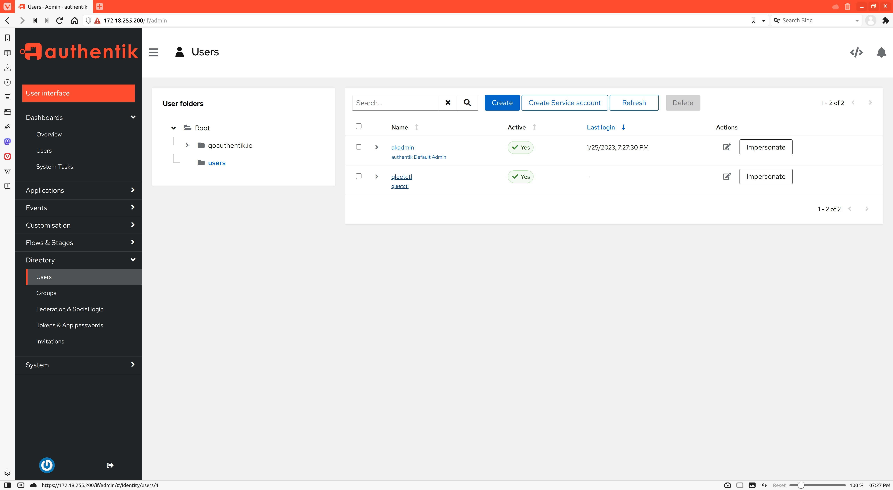
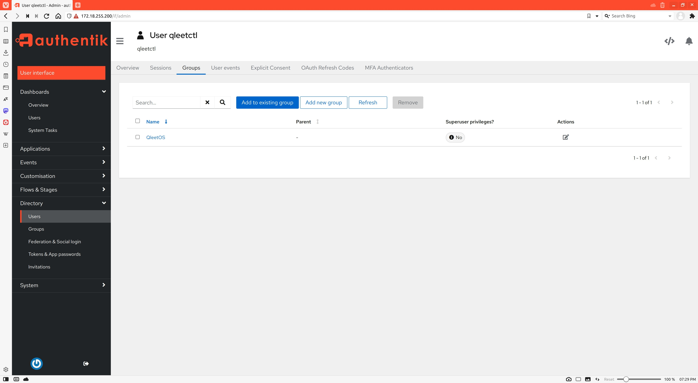
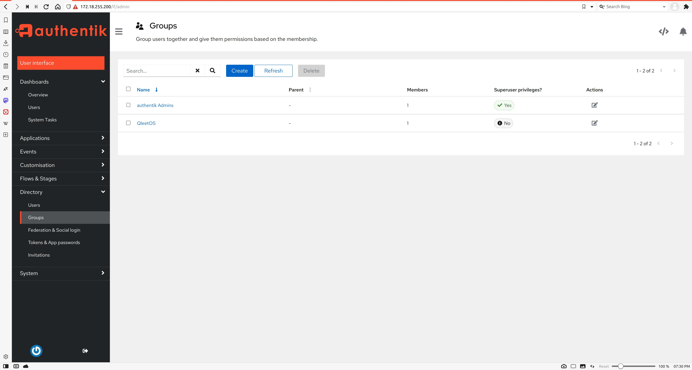
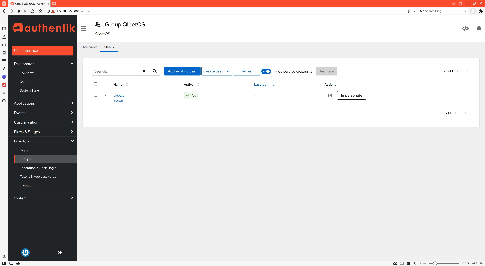
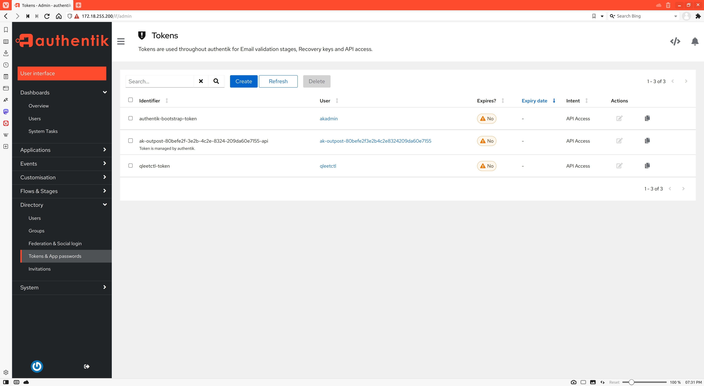

[](https://hits.seeyoufarm.com)
[](https://opensource.org/licenses/MIT)
# POC for [Authentik](https://goauthentik.io/) [Go client library](https://github.com/goauthentik/client-go)

- K8s deployment
- [gotest](/gotest), POC project utilizing [goauthentik/client-go](https://github.com/goauthentik/client-go), programmatically creates Users, Groups, OAuth tokens etc.
  - create Group
  - create User
  - create User's password
  - create User's OAuth token
  - get User's Groups (using User's OAuth token)

## Requirements

- [gvm](https://github.com/moovweb/gvm) Go 1.22.4
    ```bash
    gvm install go1.22.4 --prefer-binary --with-build-tools --with-protobuf
    gvm use go1.22.4 --default
    ```
- [kind](https://kind.sigs.k8s.io/docs/user/quick-start/#installation)
- [kubectl](https://kubernetes.io/docs/tasks/tools/#kubectl)
- [docker](https://docs.docker.com/get-docker/)
- [docker-compose](https://docs.docker.com/compose/install/)
  ```bash
  sudo apt-get install -y docker-compose
  ```

## K8s

### Deploy on K8s (PostgreSQL)

Authentik manifests already generated with Authentik Helm chart and configures with `AUTHENTIK_BOOTSTRAP_PASSWORD` and `AUTHENTIK_BOOTSTRAP_TOKEN` if you need 
to change them see next chapter first.

Execute script to deploy manifests and open browser window, login: `akadmin`, pwd: `Authentik01234567890!`

```bash
./scripts/deploy-authentik-k8s.sh
```

## Create Authentik k8s manifests using Helm

```bash
helm repo add authentik https://charts.goauthentik.io
helm repo update

helm template authentik authentik/authentik -f ./k8s/postgresql/values.yml > ./k8s/postgresql/authentik-postgresql.yml
```

If you want to set predefined `password` and `token` for the default admin user `akadmin`:

edit `./k8s/postgresql/authentik-postgresql.yml` ->  Deployment `authentik-server`

```yaml
apiVersion: apps/v1
kind: Deployment
metadata:
  name: authentik-server
  ...
spec:
  ...
  template:
    ...
    spec:
      containers:
        - name: authentik
          ...
          env:            
            ...
            - name: AUTHENTIK_BOOTSTRAP_PASSWORD
              value: "Authentik01234567890!"
            - name: AUTHENTIK_BOOTSTRAP_TOKEN
              value: "NoMlxBQuYgfu3j19ygGqhjXenAjrJgOfN5naqmSDBUhdLjYqHKze7yyzY07H"
```

edit `./k8s/postgresql/authentik-postgresql.yml` ->  Deployment `authentik-worker`

```yaml
apiVersion: apps/v1
kind: Deployment
metadata:
  name: authentik-worker
  ...
spec:
  ...
  template:
    ...
    spec:
      ...
      containers:
        - name: authentik
          ...
          env:            
            ...
            - name: AUTHENTIK_BOOTSTRAP_PASSWORD
              value: "Authentik01234567890!"
            - name: AUTHENTIK_BOOTSTRAP_TOKEN
              value: "NoMlxBQuYgfu3j19ygGqhjXenAjrJgOfN5naqmSDBUhdLjYqHKze7yyzY07H"
```

### ### Deploy on K8s (CockroachDB, experimental, not working yet)

```bash
# create manifests if needed
helm template crdb cockroachdb/cockroachdb --namespace default \
--set fullnameOverride=crdb \
--set single-node=true \
--set statefulset.replicas=1 > ./k8s/cockroachdb/cockroachdb.yml

# create namespace
kubectl create ns threeport-api

# deploy cockroachdb
kubectl apply -f ./k8s/cockroachdb/cockroachdb.yml
echo "waiting for cockroachdb to get ready"
kubectl wait pod -n threeport-api crdb-0 --for condition=Ready --timeout=180s

# deploy authentik
kubectl apply -f ./k8s/cockroachdb/authentik-cockroachdb.yml
kubectl apply -f ./k8s/cockroachdb/crdb-test-pod.yml

# undeploy authentik
kubectl delete -f ./k8s/cockroachdb/authentik-cockroachdb.yml

# undeploy cockroachdb
kubectl delete -f ./k8s/cockroachdb/cockroachdb.yml
kubectl delete -f ./k8s/cockroachdb/crdb-test-pod.yml
```

### Python/CockroachDB error

```log
✔ 14:31 ~/projects/authentik-k8s [ main|✚ 1] $ k logs -n threeport-api authentik-server-5cc447f9fb-8wwv2 
Defaulted container "authentik" out of: authentik, db-init (init)
{"event": "Loaded config", "level": "debug", "logger": "authentik.lib.config", "timestamp": 1674588685.27217, "file": "/authentik/lib/default.yml"}
{"event": "Loaded environment variables", "level": "debug", "logger": "authentik.lib.config", "timestamp": 1674588685.2725286, "count": 46}
{"event": "Starting authentik bootstrap", "level": "info", "logger": "authentik.lib.config", "timestamp": 1674588685.2726445}
{"event": "PostgreSQL connection successful", "level": "info", "logger": "authentik.lib.config", "timestamp": 1674588685.2753716}
{"event": "Redis Connection successful", "level": "info", "logger": "authentik.lib.config", "timestamp": 1674588685.27696}
{"event": "Finished authentik bootstrap", "level": "info", "logger": "authentik.lib.config", "timestamp": 1674588685.276978}
{"event": "Bootstrap completed", "level": "info", "logger": "bootstrap"}
{"event": "Loaded config", "level": "debug", "logger": "authentik.lib.config", "timestamp": 1674588685.4033535, "file": "/authentik/lib/default.yml"}
{"event": "Loaded environment variables", "level": "debug", "logger": "authentik.lib.config", "timestamp": 1674588685.4036634, "count": 46}
2023-01-24 19:31:25 [info     ] applying django migrations
2023-01-24 19:31:25 [info     ] waiting to acquire database lock
Traceback (most recent call last):
  File "<frozen runpy>", line 198, in _run_module_as_main
  File "<frozen runpy>", line 88, in _run_code
  File "/lifecycle/migrate.py", line 83, in <module>
    wait_for_lock()
  File "/lifecycle/migrate.py", line 40, in wait_for_lock
    curr.execute("SELECT pg_advisory_lock(%s)", (ADV_LOCK_UID,))
psycopg2.errors.UndefinedFunction: unknown function: pg_advisory_lock(): function undefined

```

Root cause: `psycopg2.errors.UndefinedFunction: unknown function: pg_advisory_lock(): function undefined`

- [sql: fill out pg_advisory_lock stubs](https://github.com/cockroachdb/cockroach/issues/13546)
- [CockroachDB does not support pg_advisory_loc() function today](https://github.com/golang-migrate/migrate/issues/703)
- [Support for CockroachDB](https://github.com/goharbor/harbor/issues/8649)


## Docker Compose

### Run using docker-compose

```bash
./scripts/start-docker-compose-authentik.sh
```

## Run POC 

Run POC to perform following using [goauthentik/client-go](https://github.com/goauthentik/client-go)
- create `qleetctl` user 
- create `qleetctl` user's `passowrd` and `token`
- create `QleetOS` group
- assing `qleetctl` user to `QleetOS` group
- use `qleetctl` user's `token` to find which groups it belong to

```bash
cd gotest
make run
```

## Login to Authentik Web Admin inteface

Docker Compose
```bash
echo "login: akadmin, pwd: Authentik01234567890!"
xdg-open https://localhost:9443/if/admin/#/administration/overview
```

Kubernetes
```bash
LB_IP=$(kubectl get svc/authentik -o=jsonpath='{.status.loadBalancer.ingress[0].ip}')
echo "login: akadmin, pwd: Authentik01234567890!"
xdg-open https://$LB_IP:443/if/admin/#/administration/overview
```

Login


Password


Users


User-Groups


Groups


Groups-User


Tokens

