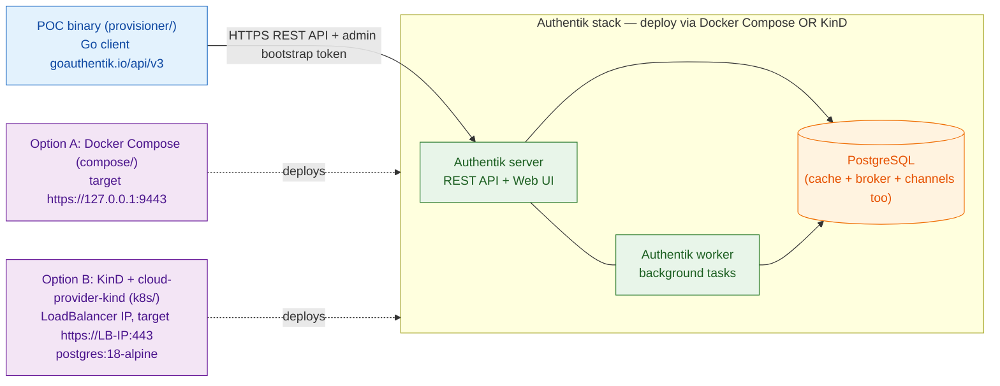
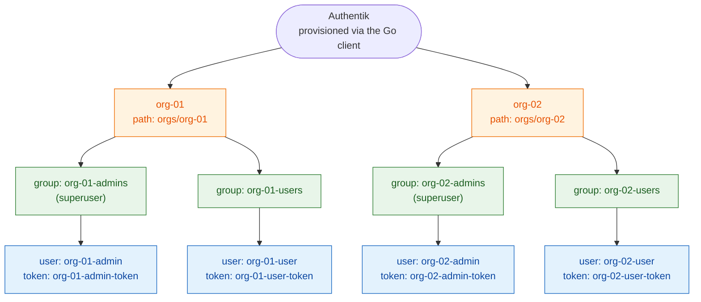
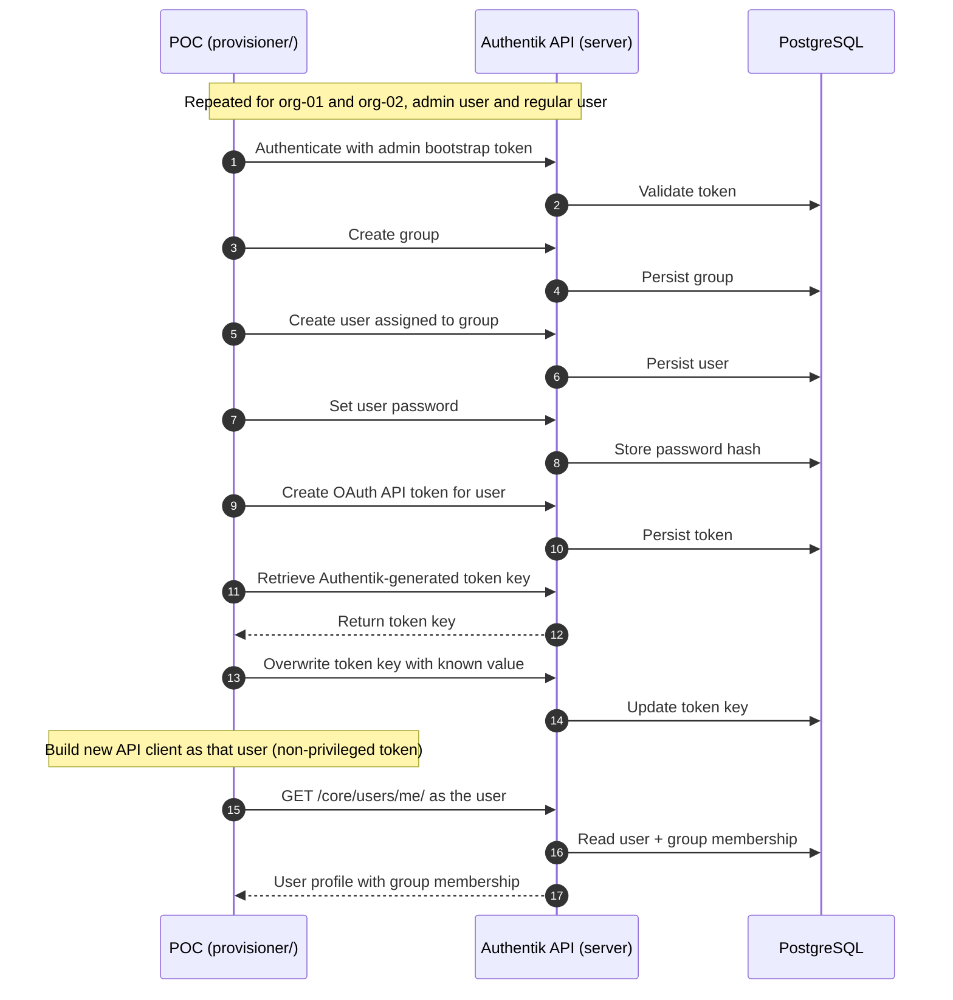

[](https://github.com/AndriyKalashnykov/authentik-k8s/actions/workflows/ci.yml)
[](https://hits.sh/github.com/AndriyKalashnykov/authentik-k8s/)
[](https://opensource.org/licenses/MIT)
[](https://renovatebot.com)
[](https://github.com/AndriyKalashnykov/authentik-k8s/blob/main/provisioner/go.mod)

# Authentik Provisioning with the Go Client

*Provision Authentik — groups, users, passwords, OAuth tokens — programmatically with the Go client. Deploy on Kubernetes (KinD) or Docker Compose.*

A proof-of-concept that drives [Authentik](https://goauthentik.io/) programmatically via its Go client library [`goauthentik.io/api/v3`](https://github.com/goauthentik/client-go) — creating groups, users, passwords and OAuth tokens, then re-authenticating as a created user to read its group membership. It ships with two ways to stand up Authentik (Docker Compose or KinD) plus the Go POC that runs against it.

## Overview

The repo has two halves:

- **Deploy Authentik** — locally via Docker Compose (lightweight) or on a full Kubernetes cluster via KinD (with `cloud-provider-kind` for LoadBalancer support and OSS PostgreSQL datastore).
- **`provisioner/`** — a Go program that provisions a demo org structure (groups, users, tokens) and verifies it end-to-end via the Authentik client.


```mermaid
flowchart LR
    POC["POC binary (provisioner/)<br/>Go client goauthentik.io/api/v3"]

    subgraph AUTHENTIK["Authentik stack — deploy via Docker Compose OR KinD"]
        direction TB
        SERVER["Authentik server<br/>REST API + Web UI"]
        WORKER["Authentik worker<br/>background tasks"]
        PG[("PostgreSQL<br/>(cache + broker + channels too)")]
        SERVER --- WORKER
        SERVER --> PG
        WORKER --> PG
    end

    POC -->|"HTTPS REST API + admin bootstrap token"| SERVER

    COMPOSE["Option A: Docker Compose (compose/)<br/>target https://127.0.0.1:9443"]
    KIND["Option B: KinD + cloud-provider-kind (k8s/)<br/>LoadBalancer IP, target https://LB-IP:443<br/>postgres:18-alpine"]

    COMPOSE -.deploys.-> AUTHENTIK
    KIND -.deploys.-> AUTHENTIK

    classDef poc fill:#e3f2fd,stroke:#1565c0,color:#0d47a1;
    classDef svc fill:#e8f5e9,stroke:#2e7d32,color:#1b5e20;
    classDef data fill:#fff3e0,stroke:#ef6c00,color:#e65100;
    classDef deploy fill:#f3e5f5,stroke:#6a1b9a,color:#4a148c;
    class POC poc;
    class SERVER,WORKER svc;
    class PG data;
    class COMPOSE,KIND deploy;
```

Everything is configured through environment variables — there are no hardcoded hosts, ports or secrets. Each consumer ships a committed `.env.example` (the source of truth) and reads an optional gitignored `.env` for overrides.

## Quick start

The fastest happy path — start Authentik with Compose, then run the POC against it:

```bash
cd provisioner
make deps          # one-time: install the toolchain (mise + Go/lint/kind/kubectl)
make compose-up    # start Authentik (PostgreSQL + server + worker), wait until ready
make run           # run the POC against https://127.0.0.1:9443
make compose-down  # tear it down (removes volumes)
```

## Prerequisites

- [Docker](https://docs.docker.com/get-docker/) (and the Compose plugin) — the only hard prerequisite.
- Everything else (Go, golangci-lint, govulncheck, hadolint, kind, kubectl) is installed via [mise](https://mise.jdx.dev):

```bash
cd provisioner
make deps   # installs mise (if missing) + the pinned toolchain from .mise.toml
```

## Configuration

All config is externalized to environment variables. Each consumer has a committed `.env.example` (source of truth) and a gitignored `.env` for your overrides:

```bash
cp provisioner/.env.example  provisioner/.env     # POC config
cp compose/.env.example compose/.env    # Compose stack config
```

| File | Key variables |
|------|---------------|
| `provisioner/.env.example` | `AUTHENTIK_SCHEME`, `AUTHENTIK_HOST`, `AUTHENTIK_BOOTSTRAP_TOKEN`, `AUTHENTIK_USER_PASSWORD`, `AUTHENTIK_ORG1`/`AUTHENTIK_ORG2`, and the 4 per-user OAuth token keys |
| `compose/.env.example` | `PG_*`, `AUTHENTIK_SECRET_KEY`, `AUTHENTIK_BOOTSTRAP_PASSWORD`/`AUTHENTIK_BOOTSTRAP_TOKEN`, `AUTHENTIK_TAG`, … |

`provisioner/main.go` falls back to the same defaults documented in `.env.example`, so the POC runs **with or without** a `.env`. `make run` / `make e2e-compose` load these files automatically.

> [!IMPORTANT]
> The shipped values are **demo credentials — rotate them for any real deployment.** The POC's `AUTHENTIK_BOOTSTRAP_TOKEN` must match the token of whatever Authentik you target (the compose `.env` or the committed k8s manifest). The defaults already match.

## Deploying Authentik

### Docker Compose (lightweight)

```bash
cd provisioner
make compose-up      # start PostgreSQL + server + worker, wait until ready
make compose-logs    # follow logs
make compose-down    # stop + remove volumes
```

Authentik is served at `https://127.0.0.1:9443`.

### Kubernetes (KinD)

Stands up a full KinD cluster with a `cloud-provider-kind` LoadBalancer and OSS PostgreSQL datastore:

```bash
cd provisioner
make kind-up    # create cluster + deploy Authentik, expose via LoadBalancer
make kind-down  # delete cluster, stop cloud-provider-kind, prune kindccm-* sidecars
```

`make kind-up` prints the assigned LoadBalancer IP; point the POC at it with `AUTHENTIK_HOST=<LB-IP>:443`.

## Running the POC

For each demo org — `org-01` and `org-02` — and for both an admin and a regular user (four group + user pairs in total: e.g. group `org-01-admins` with user `org-01-admin`), the POC:

1. creates the group and the user (assigned to the group),
2. sets the user's password and creates an OAuth API token,
3. overwrites the token with a known key,
4. re-authenticates **as that user** with the token and reads back its group membership.

The resulting structure — a tree of org → group → user (+ API token), built per org `org-01` then `org-02`:


```mermaid
flowchart TD
    ROOT(["Authentik<br/>provisioned via the Go client"])
    ROOT --> O1["org-01<br/>path: orgs/org-01"]
    ROOT --> O2["org-02<br/>path: orgs/org-02"]
    O1 --> O1A["group: org-01-admins<br/>(superuser)"]
    O1 --> O1U["group: org-01-users"]
    O1A --> O1AU["user: org-01-admin<br/>token: org-01-admin-token"]
    O1U --> O1UU["user: org-01-user<br/>token: org-01-user-token"]
    O2 --> O2A["group: org-02-admins<br/>(superuser)"]
    O2 --> O2U["group: org-02-users"]
    O2A --> O2AU["user: org-02-admin<br/>token: org-02-admin-token"]
    O2U --> O2UU["user: org-02-user<br/>token: org-02-user-token"]
    classDef org fill:#fff3e0,stroke:#ef6c00,color:#e65100;
    classDef grp fill:#e8f5e9,stroke:#2e7d32,color:#1b5e20;
    classDef usr fill:#e3f2fd,stroke:#1565c0,color:#0d47a1;
    class O1,O2 org;
    class O1A,O1U,O2A,O2U grp;
    class O1AU,O1UU,O2AU,O2UU usr;
```

The flow the POC runs against the API for each pair:


```mermaid
sequenceDiagram
    autonumber
    participant POC as POC (provisioner/)
    participant API as Authentik API (server)
    participant DB as PostgreSQL

    Note over POC,API: Repeated for org-01 and org-02, admin user and regular user
    POC->>API: Authenticate with admin bootstrap token
    API->>DB: Validate token
    POC->>API: Create group
    API->>DB: Persist group
    POC->>API: Create user assigned to group
    API->>DB: Persist user
    POC->>API: Set user password
    API->>DB: Store password hash
    POC->>API: Create OAuth API token for user
    API->>DB: Persist token
    POC->>API: Retrieve Authentik-generated token key
    API-->>POC: Return token key
    POC->>API: Overwrite token key with known value
    API->>DB: Update token key
    Note over POC: Build new API client as that user (non-privileged token)
    POC->>API: GET /core/users/me/ as the user
    API->>DB: Read user + group membership
    API-->>POC: User profile with group membership
```

```bash
cd provisioner
make run                             # against a running Authentik (compose default: https://127.0.0.1:9443)

make image-build && make image-run   # or containerized (distroless image, config via --env-file)
```

## End-to-end & tests

E2E targets stand up a **real** Authentik, provision + verify, then tear everything down:

```bash
cd provisioner
make e2e-compose   # E2E against Authentik on Docker Compose (lightweight)
make e2e           # E2E against Authentik on KinD (full cluster) == kind-up + test + kind-down
```

Unit + hermetic `httptest` contract tests require no infrastructure:

```bash
make test
```

## Development

Run `make help` for the full list. Common targets:

| Target | Description |
|--------|-------------|
| `make deps` | Install the pinned toolchain (Go + lint/vuln/kind/kubectl) via mise |
| `make build` | Compile the POC binary into `bin/` |
| `make run` | Run the POC against a running Authentik |
| `make test` | Run unit + httptest contract tests |
| `make lint` | Run golangci-lint + verify `go.mod`/`go.sum` are tidy |
| `make lint-docker` | Lint the Dockerfile with hadolint |
| `make vulncheck` | Scan dependencies with govulncheck |
| `make compose-lint` | Lint the Compose file with dclint (rules in `.dclintrc.yaml`) |
| `make static-check` | Composite gate: alignment + lint + hadolint + mermaid + compose + vulncheck + trivy-fs + secrets |
| `make image-build` / `make image-run` | Build / run the distroless container image |
| `make image-scan` | Build the image and scan it for HIGH/CRITICAL CVEs (Trivy) |
| `make compose-up` / `make compose-down` | Start / stop the Authentik Compose stack |
| `make kind-up` / `make kind-down` | Create+deploy / destroy the KinD cluster |
| `make k8s-generate` | Regenerate `k8s/postgresql/` from the pinned Authentik chart + `values.yml` |
| `make e2e-compose` / `make e2e` | End-to-end against Compose / KinD |
| `make renovate-validate` | Validate `renovate.json` |
| `make ci` | Full local CI pipeline (`static-check` + `test` + `build`) |

- **Toolchain** — pinned in `provisioner/.mise.toml` (go 1.26.4, golangci-lint, govulncheck, hadolint, kind, kubectl); installed with `make deps`.
- **Renovate** — `renovate.json` tracks every pinned version; validate with `make renovate-validate`.
- **CI** — `.github/workflows/ci.yml` runs static-check + build + test + a `docker` job (image build + Trivy scan) + a live `e2e` job (Authentik via Compose). Reproduce the core gate locally with `make ci`.

## Web UI

At the login screen enter username `akadmin` (Authentik's fixed bootstrap admin,
hardcoded — no env var); at the password screen enter the **value** of
`AUTHENTIK_BOOTSTRAP_PASSWORD` from [`compose/.env.example`](compose/.env.example),
its single source of truth — `grep AUTHENTIK_BOOTSTRAP_PASSWORD compose/.env.example | cut -d= -f2`.
(Compose admin UI: `https://localhost:9443/if/admin/`.) See [docs/web-ui.md](docs/web-ui.md)
for annotated screenshots of the provisioned users, groups, and tokens, plus how
to regenerate them.

## Notes & caveats

- **Demo credentials.** All shipped secrets in `.env.example` files are for demonstration only — rotate them before any real use.
- **OSS datastore.** The Kubernetes manifest is generated from the Authentik Helm chart with its bundled Bitnami PostgreSQL subchart disabled (the Bitnami image was removed from Docker Hub) and an OSS `postgres:18-alpine` workload supplied instead — see `make k8s-generate`. No Redis/Valkey: Authentik dropped Redis in 2025.10 (cache, task broker, and channels are all PostgreSQL-backed).
- **PostgreSQL is the only supported datastore.** CockroachDB and YugabyteDB were evaluated as alternatives and neither works with Authentik's Django migrations (CockroachDB lacks session `pg_advisory_lock()`; YugabyteDB has it but its distributed-transaction model aborts the migrations on `YB001`). The experimental manifests were removed; the full investigation is kept in [`docs/spikes/authentik-cockroachdb-yugabytedb.md`](docs/spikes/authentik-cockroachdb-yugabytedb.md).

## References

- [Authentik documentation](https://goauthentik.io/)
- [goauthentik/client-go](https://github.com/goauthentik/client-go) — the Go client library the POC is built on
- [Authentik and Traefik](https://github.com/brokenscripts/authentik_traefik)
