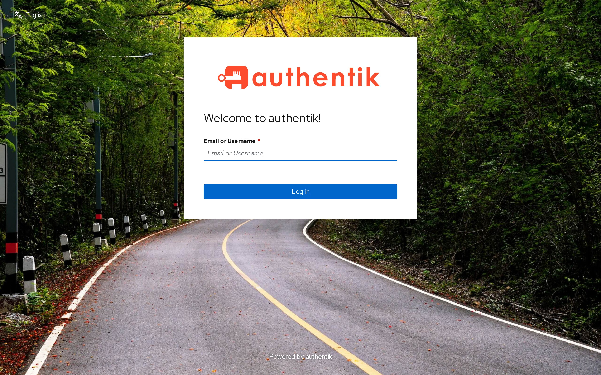
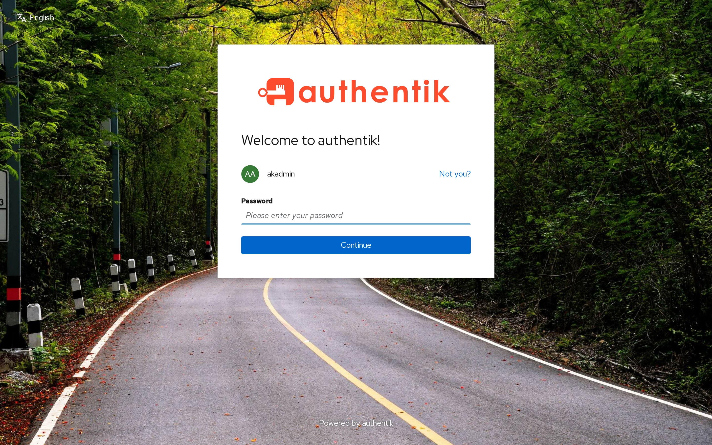
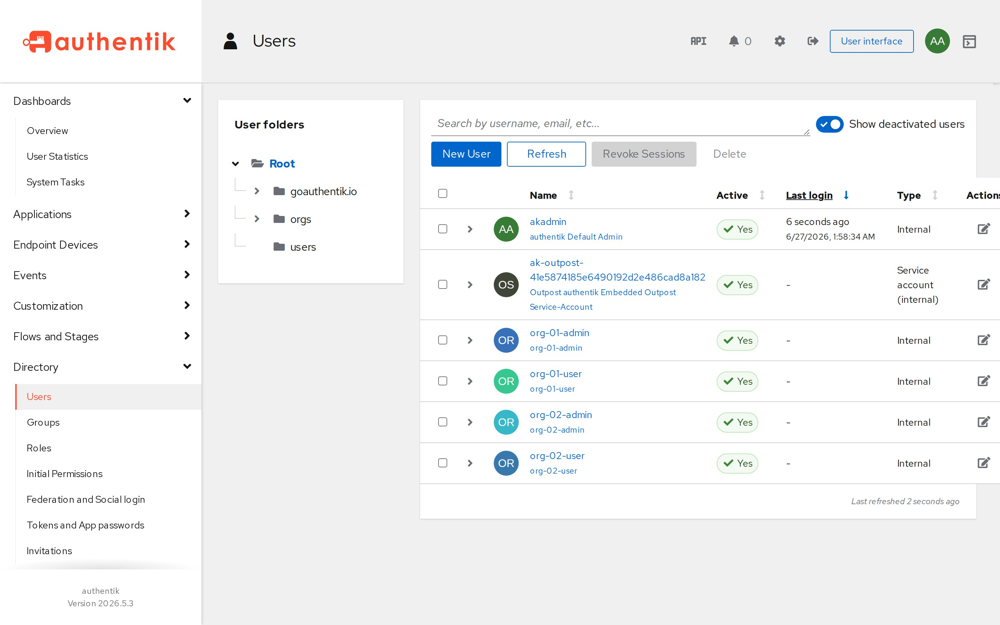
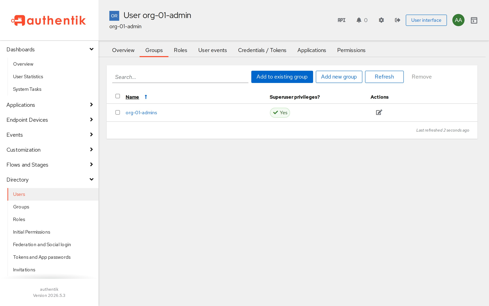
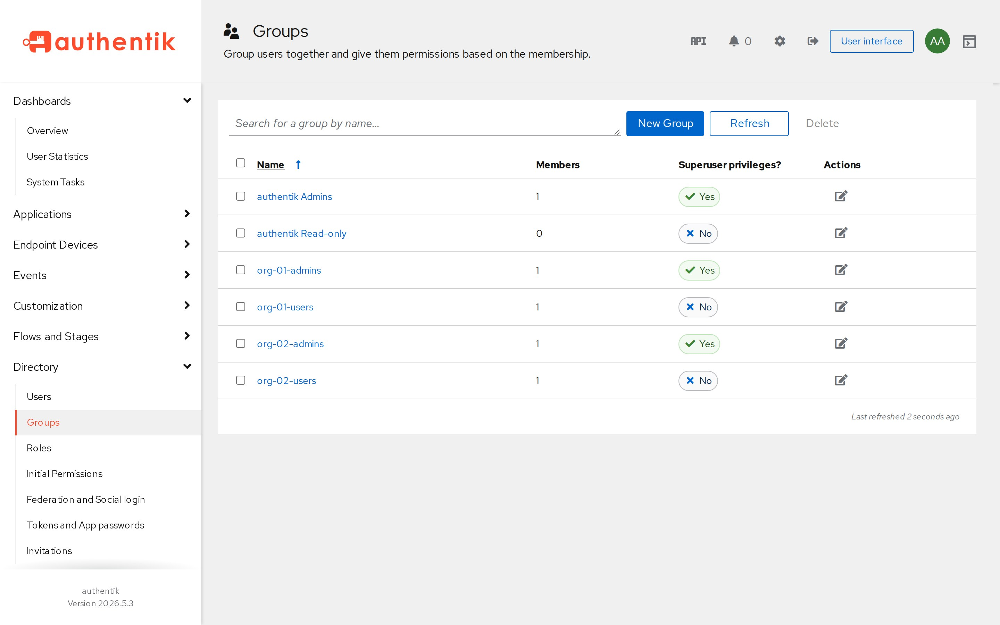
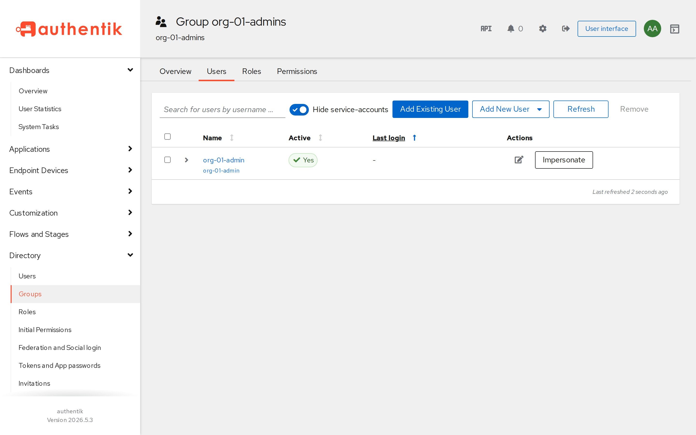
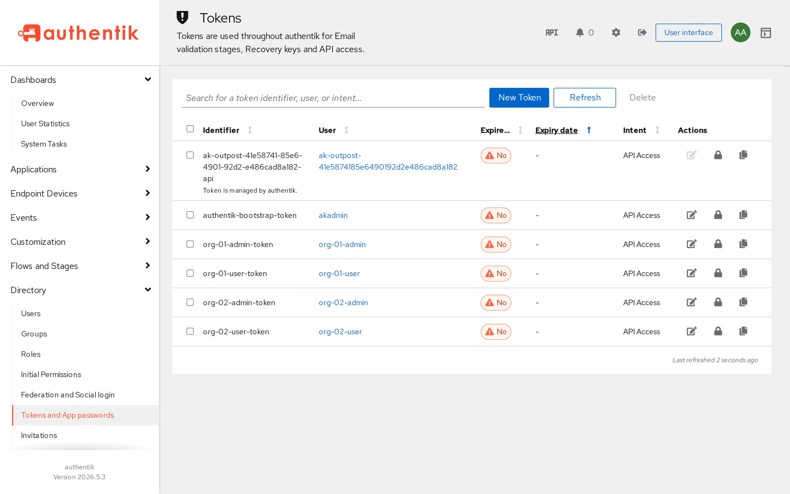

# Web UI

Screenshots of the Authentik admin interface after the provisioner has created
the demo `org-01` / `org-02` groups, users, and API tokens.

Log in as `akadmin` (Authentik's default bootstrap admin). The password is the
`AUTHENTIK_BOOTSTRAP_PASSWORD` value in [`../compose/.env.example`](../compose/.env.example)
— the single source of truth (for the KinD deployment it's the same key in
`../k8s/postgresql/authentik-postgresql.yml`). Read it with:

```bash
grep AUTHENTIK_BOOTSTRAP_PASSWORD compose/.env.example
```

- **Docker Compose:** `https://localhost:9443/if/admin/`
- **Kubernetes:** `https://<LB-IP>:443/if/admin/` (get the IP via `kubectl get svc authentik-server -o jsonpath='{.status.loadBalancer.ingress[0].ip}'`)

| | |
|---|---|
| Login |  |
| Password |  |
| Users |  |
| User Groups |  |
| Groups |  |
| Group Users |  |
| Tokens |  |

## Regenerating the screenshots

The images above are captured from a live, provisioned stack by
[`scripts/capture-web-ui-screenshots.cjs`](../scripts/capture-web-ui-screenshots.cjs)
(Playwright — it drives the multi-step login flow and the shadow-DOM admin SPA,
and skips the self-signed dev cert).

```bash
# 1. Stand up + provision the demo stack (from provisioner/)
cd provisioner && make compose-up && make run && cd ..

# 2. One-time Playwright setup
npm i playwright && npx playwright install chromium

# 3. Capture straight into docs/img/ (values are env-overridable)
AK_BASE=https://localhost:9443 node scripts/capture-web-ui-screenshots.cjs
```

Override `AK_BASE`, `AK_ADMIN_USER`, `AK_ADMIN_PASS`, `AK_DEMO_USER`,
`AK_DEMO_GROUP`, or `AK_OUT` to point at a different instance or demo identities.
